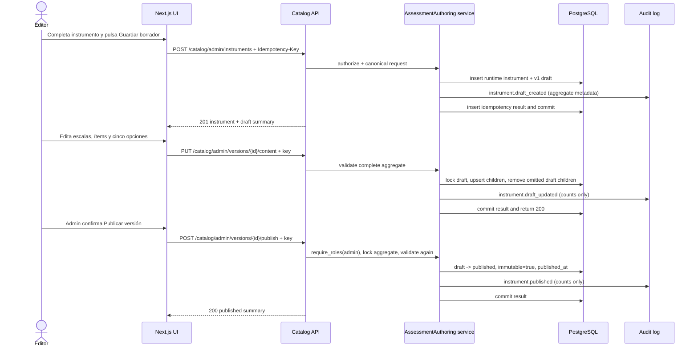

# F2 Design — Instrument Catalog

## 1. Design scope and constraints

F2 adds the catalog authoring and published-read surface on top of the F1 FastAPI/SQLAlchemy/Alembic implementation. It does not add scoring, reference-set computation, recommendations, reporting, LLM behavior, institutional ownership, or F3 session-state enforcement.

The immutable-version invariant is the primary boundary:

- `draft -> published -> archived` is the only lifecycle.
- Published and archived hierarchy rows are immutable and retained.
- A change to a published version creates a new draft with a new `instrument_version_id` and `version_no`.
- `TP-S-01:v1` is a seed-owned, read-only reference and is never an authoring parent.
- All F2 content remains `synthetic=true` and `source` identifies seed or runtime authorship.

### Existing-code alignment

The architecture documentation names `services/api/src/testpsico_api/modules/assessment_authoring/`, but the checked-out F1 repository has no `src/testpsico_api` package. Its import root is `services/api/app`, with models in `app/models`, schemas in `app/schemas`, routers in `app/api/routes`, and shared behavior in `app/core`. F2 therefore uses the physical equivalent `services/api/app/modules/assessment_authoring/` and does not introduce a second Python package. A future package-root migration can move this module without changing its contracts.

The existing F1 instruments table is `instrument_items`, and `responses.item_id` already references it. F2 retains that physical table and its item IDs rather than renaming it to `items`; this preserves seed item IDs and existing session/response foreign keys.

The future scoring engine remains outside this module. Assessment authoring may expose a read-only internal fixture projection containing the numeric mapping, but the pure scoring function receives data as input and performs no database access or side effects. F2 does not import or implement scoring or recommendation rules.

## 2. Module and file layout

### Catalog module

`services/api/app/modules/assessment_authoring/`

- `domain.py` — status constants, aggregate value objects, DTO-independent hierarchy validation, contiguous-order checks, fixed `likert_1_5` rules, and clone semantics. No SQLAlchemy session or side effects.
- `repository.py` — SQLAlchemy queries and persistence for instruments, versions, scales, items, options, and row locks. It owns no HTTP concerns.
- `service.py` — transaction orchestration for create, draft creation, aggregate save, publish, and archive. It invokes the repository, idempotency store, and audit writer in one transaction.
- `idempotency.py` — request hash, scoped record lookup/locking, result replay, and same-key conflict behavior.
- `projections.py` — published evaluator payload and the non-public F4 fixture projection. The evaluator projection must never call the fixture projection.
- `errors.py` — catalog-specific error messages/details mapped only to the existing F1 `ApiError` codes.

### F1-compatible integration files

- `services/api/app/models/instruments.py` — extend `InstrumentVersion` and `InstrumentItem`; add `Scale` and `ResponseOption`. Keep the existing model-family convention and export the new models through `app/models/__init__.py`.
- `services/api/app/models/idempotency.py` — add `IdempotencyRecord`, registered in the model package. This is infrastructure storage, not catalog content.
- `services/api/app/schemas/catalog.py` — Pydantic v2 request and response DTOs described below. The published and administration DTOs are separate types.
- `services/api/app/api/routes/catalog.py` — thin FastAPI route adapters. Every protected route declares `require_roles(...)`; service methods receive the authenticated user and DB session.
- `services/api/app/api/router.py` — include the catalog router under `/api/v1`.
- `services/api/app/core/permissions.py` — add `manage_instruments` for `admin` and `psicólogo`; retain `publish_instruments` for `admin`; keep `read_catalog` for all three roles.
- `services/api/app/core/audit.py` — add the four catalog event types and aggregate-only metadata validation.
- `services/api/app/seed/loader.py` and seed fixtures — use the new hierarchy and add `scales`/`response_options` to seed ownership and reset order. Seed code may maintain the deterministic reference graph; it is not an authoring workflow.
- `services/api/alembic/versions/0005_catalog_four_level.py` — the single migration appended after `0004_audit_append_only_trigger`.
- `packages/contracts/README.md` and the existing event-catalog contract test — update the event catalog in lockstep with `EVENT_CATALOG`.

### Web layout

The existing web app is a minimal Next.js app with Spanish copy and no catalog client layer. F2 adds:

- `apps/web/app/catalogo/page.tsx` — role-gated catalog list.
- `apps/web/app/catalogo/nuevo/page.tsx` — create-instrument flow.
- `apps/web/app/catalogo/[instrumentId]/versiones/[versionId]/page.tsx` — draft editor or immutable detail view selected by status.
- `apps/web/app/catalogo/[instrumentId]/versiones/[versionId]/vista/page.tsx` — published read-only rendering view.
- `apps/web/lib/catalog-api.ts` — typed API client, bearer propagation, `Idempotency-Key` generation/reuse, and F1 error-envelope parsing.
- `apps/web/components/catalog/` — editor, hierarchy sections, option-label editor, status badge, validation summary, and confirmation dialog components.

The current `apps/web/app/page.tsx` remains the service-status page; F2 does not mix catalog state into it.

## 3. Data model

### 3.1 Existing and amended tables

The runtime/seed identifier rules remain those in `packages/contracts/README.md`: UUID4 for runtime rows and UUID5 under `uuid5(NAMESPACE_URL, "psico-seed:" + key)` for seed rows.

#### `instruments`

No new ownership column is added. Existing columns remain `id`, `key`, `title`, `description`, `synthetic`, `source`, and `created_at`. The F2 MVP intentionally has no `institution_id`.

An instrument root is created once. Its key is unique. After the first published version, root title/description are not mutated by a draft save because doing so would change the metadata of already-published versions. A new draft may clone the existing root metadata, but F2 does not offer a root-metadata edit that can affect published content.

#### `instrument_versions`

Retain `id` as the stable exposed `instrument_version_id`, `instrument_id`, `version_no`, `status`, `published_at`, `is_immutable`, `synthetic`, and `source`. Add:

| Column | Type | Rule |
| --- | --- | --- |
| `response_type` | `VARCHAR(32)` | `NOT NULL`, exactly `likert_1_5` |
| `adaptation_metadata` | PostgreSQL `JSONB` | nullable descriptive metadata only |
| `created_at` | `TIMESTAMPTZ` | `NOT NULL`, server default now |
| `updated_at` | `TIMESTAMPTZ` | `NOT NULL`, updated on draft save or lifecycle transition |
| `archived_at` | `TIMESTAMPTZ` | nullable; set only on publish-to-archive |

Add `CHECK status IN ('draft','published','archived')`. Replace the F1 free-form-compatible immutability check with a constraint named `ck_published_versions_immutable` whose expression requires drafts to be mutable and published/archived versions to be immutable:

`((status = 'draft' AND is_immutable = false) OR (status IN ('published','archived') AND is_immutable = true))`.

Retain `UNIQUE (instrument_id, version_no)` as `uq_version_no_per_instrument`. No uniqueness constraint limits the number of published versions.

`adaptation_metadata` has the application-level shape:

```json
{
  "base_locale": "es",
  "target_locale": "es",
  "label": "Adaptación sintética en español",
  "description": "Metadato descriptivo; no cambia la aplicación del instrumento"
}
```

All fields are bounded strings. `base_locale` and `target_locale` are `es` in the MVP. No conditions, branching expressions, scoring rules, item filters, or executable configuration are accepted. The metadata describes an adaptation; it never changes the published hierarchy.

#### `scales` (new)

| Column | Type | Rule |
| --- | --- | --- |
| `id` | UUID | primary key; UUID4 runtime, UUID5 seed |
| `version_id` | UUID | `NOT NULL`, FK to `instrument_versions.id` |
| `label` | `VARCHAR(255)` | `NOT NULL` |
| `locale` | `VARCHAR(10)` | `NOT NULL`, F2 value `es` |
| `display_order` | INTEGER | `NOT NULL`, positive |
| `synthetic` / `source` | existing mixin types | `synthetic=true` for all F2 rows |

Constraints: `UNIQUE(version_id, display_order)`, `CHECK(display_order > 0)`, and a useful non-null parent FK index. A composite uniqueness key `(id, version_id)` is also created for the composite child-parent FK below.

#### `instrument_items` (amended physical item table)

Retain `id` and `version_id` so `responses.item_id` and session history continue to resolve to the same rows. Replace the denormalized `scale` string with `scale_id` and rename `scale_order` to `item_order`. Add:

| Column | Type | Rule |
| --- | --- | --- |
| `scale_id` | UUID | `NOT NULL`, belongs to a scale in the same version |
| `item_order` | INTEGER | `NOT NULL`, positive and unique within scale |
| `locale` | `VARCHAR(10)` | `NOT NULL`, F2 value `es` |
| `required` | BOOLEAN | `NOT NULL`, default `true` |

The existing `text`, `synthetic`, and `source` remain. Drop the old `(version_id, scale, scale_order)` uniqueness and `ck_scale_order_1_to_5`. Add `UNIQUE(scale_id, item_order)` and a composite FK `(scale_id, version_id) -> scales(id, version_id)`. The composite FK makes a cross-version attachment a database error, not only a service validation error.

`response_type` is **not** duplicated on `instrument_items`: F1 has no item-level response type and D3 fixes it at the version level. This avoids two potentially inconsistent sources of truth.

#### `response_options` (new)

| Column | Type | Rule |
| --- | --- | --- |
| `id` | UUID | primary key; UUID4 runtime, UUID5 seed |
| `item_id` | UUID | `NOT NULL`, FK to `instrument_items.id` |
| `label` | `TEXT` | `NOT NULL` |
| `locale` | `VARCHAR(10)` | `NOT NULL`, F2 value `es` |
| `display_order` | SMALLINT | `NOT NULL`, 1 through 5 |
| `value` | SMALLINT | `NOT NULL`, 1 through 5; internal only |
| `synthetic` / `source` | existing mixin types | `synthetic=true` for all F2 rows |

Constraints: `UNIQUE(item_id, display_order)`, `UNIQUE(item_id, value)`, `CHECK(display_order BETWEEN 1 AND 5)`, and `CHECK(value BETWEEN 1 AND 5)`. The application additionally requires exactly one option for each value/order 1 through 5 before save succeeds and before publish succeeds.

### 3.2 Idempotency storage

Add `idempotency_records` as a small infrastructure table:

| Column | Type | Rule |
| --- | --- | --- |
| `id` | UUID | UUID4 primary key |
| `actor_user_id` | UUID | `NOT NULL`, FK to `users.id` |
| `operation` | `VARCHAR(64)` | canonical mutation name |
| `resource_scope` | `VARCHAR(160)` | canonical resource scope |
| `idempotency_key` | `VARCHAR(255)` | `NOT NULL` |
| `request_hash` | `CHAR(64)` | SHA-256 of canonical request body |
| `response_status` | SMALLINT | committed response status |
| `response_body` | JSONB | result body used for replay |
| `created_at` | `TIMESTAMPTZ` | `NOT NULL`, server default now |

Unique key: `(actor_user_id, operation, resource_scope, idempotency_key)`. The scope is actor-specific and resource-specific: create uses `instrument-key:<key>`, draft creation uses `instrument:<id>`, and save/publish/archive use `version:<id>`.

Only successful, side-effecting mutations store a completed record. The stored result contains a resource summary, not a second copy of item text or numeric option values. A replay returns the stored success body and the current request's request-id header; it does not create a second audit event. Failed validation and state conflicts do not store a successful result.

Retention is indefinite for F2 catalog records. They contain no secrets and are needed to guarantee that a very old key cannot create a second catalog side effect. There is no automatic purge in F2; a future operational retention change would require a new contract decision and a proof that key reuse cannot duplicate a historical mutation.

### 3.3 One linear migration and backfill

Append exactly `0005_catalog_four_level` after `0004_audit_append_only_trigger`; do not create a merge revision. The migration is transactional and performs:

1. Verify existing version statuses are already `draft`, `published`, or `archived`; abort before adopting the new constraint if an unknown status is found. Set `response_type=likert_1_5`, derive timestamps for existing rows, and preserve existing IDs and publication timestamps.
2. Create `scales`, `response_options`, and `idempotency_records` with their indexes and constraints.
3. Add the new version columns, add `archived_at`, and replace the status/immutability checks.
4. Add nullable transitional `scale_id`, `item_order`, `locale`, and `required` columns to `instrument_items`.
5. Backfill one scale for each distinct `(version_id, old scale)` group. For `TP-S-01:v1`, the scale order is read from the existing seed fixture order: Intereses 1, Aptitud verbal 2, Aptitud numérica 3, Razonamiento abstracto 4, Valores/preferencias 5. The IDs are deterministic UUID5 keys such as `TP-S-01:scale:Intereses`. For any pre-existing non-seed group, the migration assigns a stable UUID4 and deterministic first-seen order inside that version. No row is attached to another version.
6. Copy `scale_order` to `item_order`, set `scale_id`, set `locale=es`, and set `required=true` for existing F1 items. Existing `instrument_items.id` values remain unchanged, so `responses.item_id` and seeded session references remain valid.
7. Create five options for every existing item with deterministic seed option IDs such as `TP-S-01:i1:option:1`; runtime legacy items receive UUID4 option IDs. The synthetic labels are the neutral Spanish render labels `Nunca`, `Casi nunca`, `A veces`, `Casi siempre`, and `Siempre`, with values and display orders 1 through 5. This is a structural compatibility backfill required to represent the already-seeded synthetic instrument; it is not an F2 authoring edit and does not permit editing the seed. The seed loader subsequently upserts the same deterministic graph.
8. Validate that all rows have a parent, the four-level graph is complete for the existing seed, and all old response/session/reference-set foreign keys still resolve. Only then make `scale_id`, `item_order`, locale, and required non-null, drop the old `scale` and `scale_order` columns and old constraints, and add the new composite/unique constraints.
9. Install database guards for immutable published/archived hierarchy rows. A published version may only make the lifecycle update to archived; child updates/deletes and all other version edits are rejected. The seed reset transaction sets a transaction-local seed-reset marker so it can remove seed-owned rows in its documented controlled path.

The migration does not rewrite `responses.value`, and its existing `CHECK(value BETWEEN 1 AND 5)` remains unchanged. It does not change `sessions.instrument_version_id`, `reference_sets.instrument_version_id`, the seed version ID, or seed item IDs. A production rollback after F2 rows exist is an application rollback or a forward corrective migration, not a destructive downgrade.

## 4. API contract

All paths are under `/api/v1`. DTO names below are Pydantic models in `app.schemas.catalog`. UUID fields are serialized as strings in JSON. All errors use the existing single envelope with `code`, `message`, `request_id`, and `details`.

### 4.1 Endpoint paths and authorization

| Method and path | Roles | Idempotency | Purpose |
| --- | --- | --- | --- |
| `GET /catalog/published-versions/{version_id}` | `admin`, `psicólogo`, `evaluado` | no | Published-only evaluator payload |
| `GET /catalog/admin/instruments` | `admin`, `psicólogo` | no | Paginated authoring list |
| `GET /catalog/admin/instruments/{instrument_id}` | `admin`, `psicólogo` | no | Admin detail and version summaries; seed is marked read-only |
| `POST /catalog/admin/instruments` | `admin`, `psicólogo` | required | Create runtime instrument and initial draft |
| `POST /catalog/admin/instruments/{instrument_id}/versions` | `admin`, `psicólogo` | required | Allocate a new draft, optionally cloned from a runtime published version |
| `GET /catalog/admin/versions/{version_id}` | `admin`, `psicólogo` | no | Inspect full draft/archived/published authoring representation |
| `PUT /catalog/admin/versions/{version_id}/content` | `admin`, `psicólogo` | required | Atomically save a complete draft aggregate |
| `POST /catalog/admin/versions/{version_id}/publish` | `admin` | required | Validate and publish a draft |
| `POST /catalog/admin/versions/{version_id}/archive` | `admin`, `psicólogo` | required | Archive a published version |

Every route has an explicit `require_roles(...)` dependency. Unknown capability names remain deny-by-default in the F1 matrix. `evaluado` receives `FORBIDDEN` for every administration route and `auth.denied` is recorded by the existing dependency. The evaluator route never calls an administration query and never reveals a status for a non-published ID.

Administration list query parameters are `page` (default 1), `page_size` (default 20, maximum 100), optional `key`, and optional `status`. The response includes `items`, `page`, `page_size`, and `total`; list rows contain summaries rather than hierarchy content.

### 4.2 Request DTOs

`CreateInstrumentRequest`:

- `key: str` — 2–64 characters, unique, stable, uppercase/number/`_`/`-`/`.` contract format.
- `title: str` — 1–255 characters.
- `description: str | None` — bounded text.
- `adaptation: AdaptationMetadata | None` — descriptive only.

The server sets `synthetic=true`, `source=runtime`, creates UUID4 instrument/version IDs, fixes `response_type=likert_1_5`, and creates version 1 as `draft`.

`CreateDraftVersionRequest`:

- `source_version_id: UUID | None` — optional runtime published version to clone.
- `adaptation: AdaptationMetadata | None` — optional descriptive metadata.

A source ID belonging to a seed instrument, a non-published version, or another instrument is rejected with `CONFLICT` or `VALIDATION_ERROR` as applicable. A clone gets fresh UUID4 scale/item/option rows and a fresh version UUID4; the source remains untouched.

`SaveDraftContentRequest` is a full aggregate replacement/upsert:

- `response_type: Literal["likert_1_5"]`.
- `adaptation: AdaptationMetadata | None`.
- `scales: list[ScaleInput]`, where `ScaleInput` has `id: UUID | None`, `display_order: positive int`, `label: non-empty str`, `locale: Literal["es"]`, and `items: list[ItemInput]`.
- `ItemInput` has `id: UUID | None`, `item_order: positive int`, `text: non-empty str`, `locale: Literal["es"]`, `required: bool`, and exactly five `options`.
- `OptionInput` has `id: UUID | None`, `display_order: Literal[1,2,3,4,5]`, `label: non-empty str`, and `locale: Literal["es"]`. It intentionally has no `value`; the service derives the internal value from the validated order.

The aggregate must have at least one scale, every scale at least one item, scale and item orders contiguous from 1, and each item exactly one option at every order/value 1 through 5. IDs supplied in a save must belong to the target draft and must not move across parents. A save is atomic: validation happens before deletes/upserts, and a failed save leaves the previous draft content unchanged.

`AdaptationMetadata` has `base_locale`, `target_locale`, `label`, and `description`; all are bounded strings, both locales are `es`, and no dynamic behavior fields are accepted.

### 4.3 Response DTOs

`VersionSummary` contains `instrument_version_id`, `instrument_id`, `version_no`, `status`, `response_type`, `is_immutable`, `created_at`, `updated_at`, `published_at`, `archived_at`, `synthetic`, and `source`.

`CreateInstrumentResponse` contains `instrument` (`id`, `key`, `title`, `description`, `synthetic`, `source`, `created_at`) and the initial `draft: VersionSummary`.

`MutationResult` contains `instrument_version_id`, `instrument_id`, `version_no`, `status`, `is_immutable`, `counts` (`scale_count`, `item_count`, `option_count`), and the applicable lifecycle timestamp. It is the stored idempotent result body.

`AdminVersionDetail` contains the version summary, adaptation metadata, and the full ordered hierarchy. It does not include option numeric values; the editor uses option order slots 1–5. A separate non-HTTP internal fixture projection is the only F4-facing surface containing values.

`PublishedVersionRead` contains:

- `instrument_version_id`, `instrument_key`, `title`, `description`, `version_no`, `status: "published"`, `published_at`, `response_type`, and `locale: "es"`;
- safe descriptive adaptation metadata;
- ordered `scales` with `id`, `display_order`, `label`, `locale`;
- ordered `items` with `id`, `item_order`, `text`, `locale`, `required`;
- ordered `response_options` with `id`, `display_order`, `label`, and `locale`.

It contains no option `value`, answer key, right-answer marker, scoring rule, hidden internal note, token, or content outside the version. Draft, archived, missing, malformed, and unknown IDs all return the same `NOT_FOUND` envelope from this route.

The F4 internal fixture projection is not a public route and contains `instrument_version_id`, the version/scale/item IDs and orders, and option IDs with values 1–5. It is passed into a future pure scoring function; it does not expose data through the evaluator contract.

### 4.4 Error mapping

- `VALIDATION_ERROR`: malformed DTO, unsupported response type, non-Spanish locale, invalid hierarchy, non-contiguous order, wrong option cardinality, or failed publish validation.
- `FORBIDDEN`: role failure; generic message `insufficient_role`, with `auth.denied` audit.
- `NOT_FOUND`: evaluator request for a missing, draft, or archived version; no existence/status leak. Admin missing resources may use `resource_not_found`.
- `CONFLICT`: immutable edit, seed authoring attempt, archive of a non-published version, publish of a non-draft version, same-key/different-body idempotency reuse, duplicate instrument key, or seed-reset dependency conflict.
- `UNAUTHORIZED` and `INTERNAL_ERROR`: existing F1 behavior.

Representative stable messages are `invalid_catalog_version`, `version_not_draft`, `version_immutable`, `archive_requires_published`, `seed_catalog_read_only`, `idempotency_key_reused`, and `seed_reset_dependency_conflict`. Details contain safe field paths, IDs, expected state, and aggregate counts only.

## 5. Lifecycle and transaction logic

### Create and edit

1. Require `manage_instruments` through `require_roles(ADMIN, PSICOLOGO)` and require a non-empty `Idempotency-Key`.
2. Canonicalize the body and acquire the idempotency record for the actor/operation/resource scope. A completed same-hash record is replayed; a different hash returns `CONFLICT` before any write.
3. For instrument creation, create a UUID4 instrument and UUID4 version 1 in one transaction. For a new version, lock the instrument row with `SELECT ... FOR UPDATE`, calculate `max(version_no)+1`, and insert the draft. Seed roots are rejected by `source='seed'` and by the UUID5/seed identity check.
4. For a clone, lock the source version and instrument, require a runtime published source, and copy the complete hierarchy into fresh runtime UUID4 child rows. No child row points to a seed row.
5. For a draft save, lock the version, require `status=draft` and `is_immutable=false`, validate the full request and parent membership, then upsert supplied IDs, insert new UUID4 rows, and delete only draft children omitted from the complete request. The transaction records `instrument.draft_updated` only after successful persistence.
6. Store the completed idempotency result and commit data, audit, and idempotency together. A network retry after commit replays the stored result.

A draft may exist empty immediately after creation so the editor can assemble local state, but an explicit save must satisfy the full hierarchy rules. The editor therefore validates locally while typing and submits a complete aggregate.

### Publish

Lock the version row and its aggregate. Require `draft`; validate response type, locale, parent graph, contiguous order, exact five options, synthetic/source markers, and all database constraints before changing state. On failure, return `VALIDATION_ERROR` and roll back everything. On success, set `status=published`, `published_at=now`, `is_immutable=true`, and `updated_at=now`; do not alter the hierarchy or version ID. Record one aggregate-only `instrument.published` event, store the idempotency result, and commit atomically.

A database guard prevents direct edits/deletes to published rows and children. The only allowed version transition from published is the service-controlled archive transition. Multiple published versions under one instrument are permitted.

### Archive

Lock the version. Require `status=published`; otherwise return `CONFLICT` and leave the row untouched. Set `status=archived`, `archived_at=now`, retain `is_immutable=true`, record `instrument.archived`, store the result, and commit. There is no unarchive operation. Existing sessions and references retain their original `instrument_version_id`; F3 decides that archived versions cannot start new sessions.

### Version-number concurrency

`version_no` allocation is serialized by a row lock on the parent instrument. The unique constraint is a second safety net. Two concurrent draft creations therefore receive consecutive values; they cannot both receive the same value. If a transaction loses a race outside the lock or encounters a unique violation, the service rolls back and returns a stable `CONFLICT` rather than silently replacing a draft. Idempotent retries do not allocate another number.

## 6. Audit and idempotency behavior

Add these values to `EVENT_CATALOG` and `packages/contracts/README.md` in lockstep:

- `instrument.draft_created` — successful instrument/initial-draft or new-draft creation.
- `instrument.draft_updated` — explicit successful aggregate save only.
- `instrument.published` — successful draft-to-published transition; remains canonical.
- `instrument.archived` — successful published-to-archived transition.

Every catalog event uses the existing `audit.record` writer and includes:

- actor user ID and role snapshot;
- `instrument_id`, `instrument_version_id`, `version_no`;
- action and status transition;
- `scale_count`, `item_count`, and `option_count`.

It never includes item text, option labels/keys if treated as content, option values, raw responses, tokens, passwords, PII, scoring rules, or internal notes. The metadata keys avoid the existing deny-list and are checked by `assert_deny_list`.

The audit row is inserted in the same transaction as the mutation and idempotency record. A retry returns before the mutation/audit path, so one successful save/publish/archive produces exactly one corresponding catalog event. Validation failures produce no success event. Role denials continue to use the existing committed `auth.denied` event.

## 7. Web information architecture and behavior

### Pages and permissions

- `/catalogo`: `admin` and `psicólogo` see the administration list with filters for `Borradores`, `Publicados`, and `Archivados`. `evaluado` sees no administration navigation.
- `/catalogo/nuevo`: `admin` and `psicólogo` create an instrument. The seed key is never offered as a selectable parent.
- `/catalogo/[instrumentId]/versiones/[versionId]`: editor for drafts; read-only administration detail for published/archived versions. It has sections `Datos del instrumento`, `Escalas`, `Ítems`, and `Opciones de respuesta`.
- `/catalogo/[instrumentId]/versiones/[versionId]/vista`: published-only evaluator rendering. It shows the Spanish hierarchy and labels but never numeric option values.

The UI uses the existing Spanish conventions: `Catálogo de instrumentos`, `Nuevo instrumento`, `Guardar borrador`, `Vista previa`, `Publicar versión`, `Archivar versión`, `Versión publicada`, `Versión archivada`, `Este instrumento es de referencia y no se puede editar`, `La versión publicada es inmutable`, `Confirmar publicación`, and `Confirmar archivo`.

### Editor behavior

The editor maintains an in-memory aggregate while the user types. It validates required fields, Spanish locale, positive contiguous orders, non-empty scales/items, exactly five option slots, and supported response type before calling the API. Option slot numbers are shown as 1–5 for authoring clarity; the numeric server mapping is not returned by the API. Server validation remains authoritative and maps `VALIDATION_ERROR.details` to the relevant scale/item/option path. Network and conflict failures display the stable message and request ID for support.

Each user intent gets one idempotency key. A timeout retry reuses that key; a new save after the user changes content gets a new key. Publish is shown only to `admin`; archive is shown to `admin` and `psicólogo`. Both require confirmation and explain that publication freezes the version and archive keeps historical references. Seed rows show a read-only badge and no edit, clone-under-seed, publish, or archive controls.

Client gating is usability only. Every request is still protected by FastAPI `require_roles`, and the server remains the authority for seed/read-only and lifecycle rules.

## 8. Required sequence diagrams

### 8.1 Create, edit, and publish



### 8.2 Publication validation failure

```mermaid
sequenceDiagram
    actor A as Admin
    participant API as Catalog API
    participant S as AssessmentAuthoring service
    participant DB as PostgreSQL
    participant Audit as Audit log

    A->>API: POST /catalog/admin/versions/{id}/publish
    API->>S: lock draft and load hierarchy
    S->>DB: validate scales/items/options and orders
    DB-->>S: empty scale / invalid aggregate
    S-->>API: VALIDATION_ERROR + safe field details
    API-->>A: 422 F1 error envelope
    Note over DB: Transaction rolls back; status remains draft
    Note over Audit: No instrument.published event is written
```

### 8.3 Idempotent retry

```mermaid
sequenceDiagram
    actor C as Client
    participant API as Catalog API
    participant S as Service
    participant DB as PostgreSQL
    participant Audit as Audit log

    C->>API: POST publish + key K + body H
    API->>S: acquire scoped record(actor, operation, version, K)
    S->>DB: mutate version + insert audit + store result
    S->>DB: commit
    API-->>C: 200 result R

    C->>API: retry publish + key K + body H
    API->>S: lock existing idempotency record
    S->>DB: read completed result R
    DB-->>S: R
    S-->>API: replay R; skip mutation and audit
    API-->>C: 200 result R

    C->>API: same key K + materially different body H2
    API->>S: compare request hash
    S-->>API: CONFLICT idempotency_key_reused
    API-->>C: 409 F1 error envelope; no side effect
```

### 8.4 Seed reset with runtime coexistence

```mermaid
sequenceDiagram
    actor X as Admin/seed CLI
    participant Seed as Seed loader
    participant DB as PostgreSQL
    participant Runtime as Runtime catalog rows

    X->>Seed: python -m app.seed --reset
    Seed->>DB: begin transaction + advisory seed-reset lock
    Seed->>DB: lock seed roots and run non-seed dependency preflight
    Runtime-->>DB: no cross-ownership found
    Seed->>DB: delete seed rows in reverse FK order
    Seed->>DB: insert deterministic seed instrument/scales/items/options
    Seed->>DB: write manifest + seed.executed
    Seed->>DB: commit
    DB-->>X: reset_and_seeded; runtime rows unchanged

    alt Unexpected non-seed reference
        Runtime-->>DB: dependency found
        DB-->>Seed: stable CONFLICT seed_reset_dependency_conflict
        Seed->>DB: rollback before first delete
        DB-->>X: conflict; all seed and runtime rows unchanged
    end
```

## 9. Architecture decision records

### ADR-001 — Separate published read payload from administration and F4 fixture payload

**Decision:** Use `/catalog/published-versions/{id}` for all roles, return labels and stable option IDs but omit numeric values and internal rules. Keep administration DTOs separate, and expose numeric option mappings only through a non-HTTP internal F4 fixture projection.

**Rationale:** F3 needs a safe rendering contract; F4 needs the exact 1–5 mapping. One DTO would either leak answer-key data or starve scoring fixtures. Separate projections make the boundary testable and preserve the pure scoring contract.

### ADR-002 — Same idempotency key with a different body returns `CONFLICT`

**Decision:** Compare canonical request hashes. Same scope/key/same hash replays; same scope/key/different hash returns `CONFLICT` and performs no write.

**Rationale:** Replaying an old result for a materially new intent is surprising, while executing the new body violates idempotency. Explicit conflict exposes client misuse and is safer for publication and immutable data than silent replay.

### ADR-003 — Persist catalog idempotency records indefinitely

**Decision:** Store a completed result and request hash in `idempotency_records` with actor, operation, and resource scope. Do not automatically purge F2 records.

**Rationale:** The catalog has low mutation volume, and indefinite records are the only simple way to guarantee that key reuse cannot duplicate a historical audit or version side effect. The stored result is a summary and contains no secrets. Any future retention change requires a new safety decision.

### ADR-004 — Enforce status and immutability in the migration and service

**Decision:** Add explicit status and immutable-state CHECK constraints, plus database guards for published/archived hierarchy rows; enforce lifecycle transitions and full publication validation in the service.

**Rationale:** CHECK constraints prevent free-text states, service logic provides useful F1 error envelopes and aggregate validation, and database guards protect against bypassing the API. The guard permits only the controlled published-to-archived transition and a transaction-local seed reset path.

### ADR-005 — Seed reset uses an atomic dependency preflight

**Decision:** Take a transaction/advisory lock, inspect every non-seed FK path into seed catalog rows, and abort with `CONFLICT` before deletion if any cross-ownership exists. Otherwise delete/reseed only `source='seed'` rows in reverse FK order.

**Rationale:** D1 makes runtime catalog roots independent, so normal reset can coexist safely. The preflight fails closed for unexpected data and prevents a seed parent from being deleted underneath a runtime session, reference, or catalog child.

### ADR-006 — Allocate `version_no` under a parent-instrument row lock

**Decision:** Lock the instrument row, calculate the next number, insert the draft, and retain the unique `(instrument_id, version_no)` constraint as a backstop.

**Rationale:** This is deterministic on PostgreSQL, supports multiple published versions, and serializes concurrent authors without a fragile application-only counter. Idempotent retries return the original version rather than allocate another number.

## 10. Verification and rollout

### Verification focus

The implementation should verify, at minimum:

- migration upgrade from an F1 database, linear head, preserved seed/version/item/session/response IDs, exact five-option seed backfill, and status/foreign-key constraints;
- domain validation for order, parent membership, locale, response type, option cardinality/value uniqueness, and synthetic/source markers;
- concurrent version creation and idempotent replay/conflict behavior;
- atomic save/publish/archive behavior and absence of audit rows on failed mutations;
- one audit event per successful mutation, aggregate-only metadata, and append-only enforcement;
- role matrix, evaluator non-existence leak behavior, and no numeric values in the published DTO;
- seed reset with independent runtime rows and rollback on a cross-ownership preflight conflict;
- Spanish UI permission gating, local/server validation, confirmation behavior, and published read rendering.

The current `openspec/config.yaml` reports no available test runner, linter, type checker, or build command; this design does not invent one. Tests should follow the repository's F1 conventions when a runner is introduced.

### Rollout order

1. Apply `0005_catalog_four_level` against a verified F1 snapshot and inspect seed/session/response/reference-set counts.
2. Deploy models, service, API contracts, permissions, audit catalog, and seed loader together; the application release assumes the new schema is present.
3. Run the idempotent seed path once and verify `TP-S-01:v1` remains UUID5, published, immutable, and read-only.
4. Exercise `seed --reset` with independent runtime rows before enabling authoring UI. Preserve the F1 database snapshot during the first migration/reset rehearsal.
5. Enable catalog administration for `admin`/`psicólogo`; expose only published reads to `evaluado`.

If migration fails before adoption, stop and restore the verified snapshot in non-production. Once F2 runtime rows exist, do not downgrade destructively; roll back the application release or use a maintainer-approved forward migration. Never repair a published version in place.
